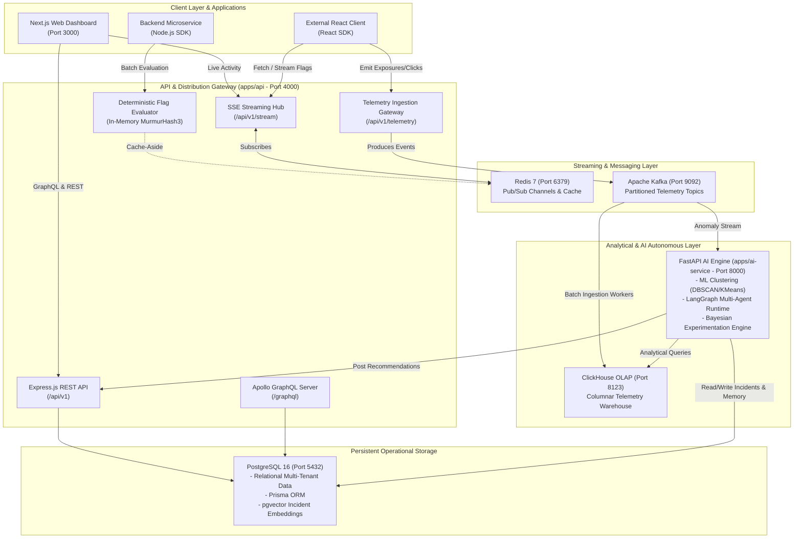
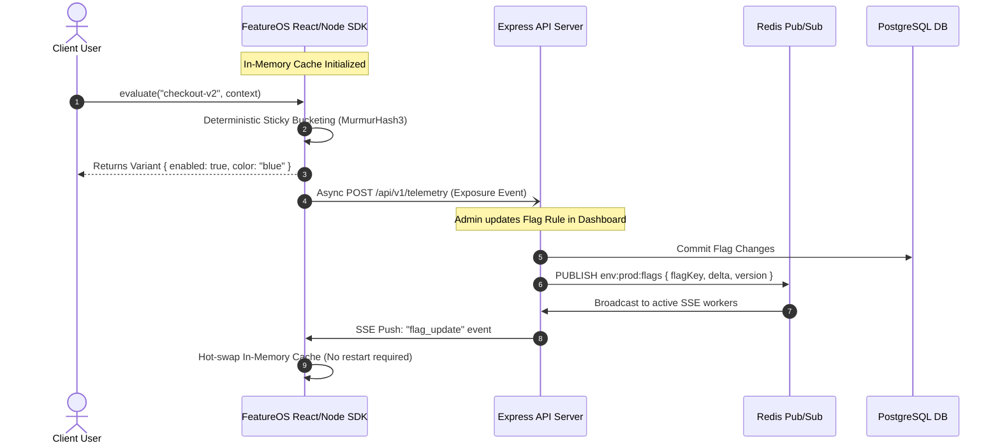
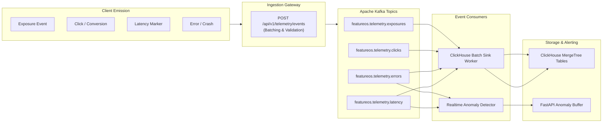
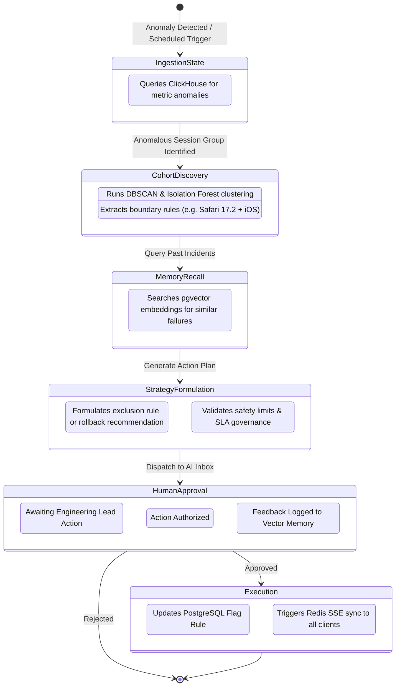
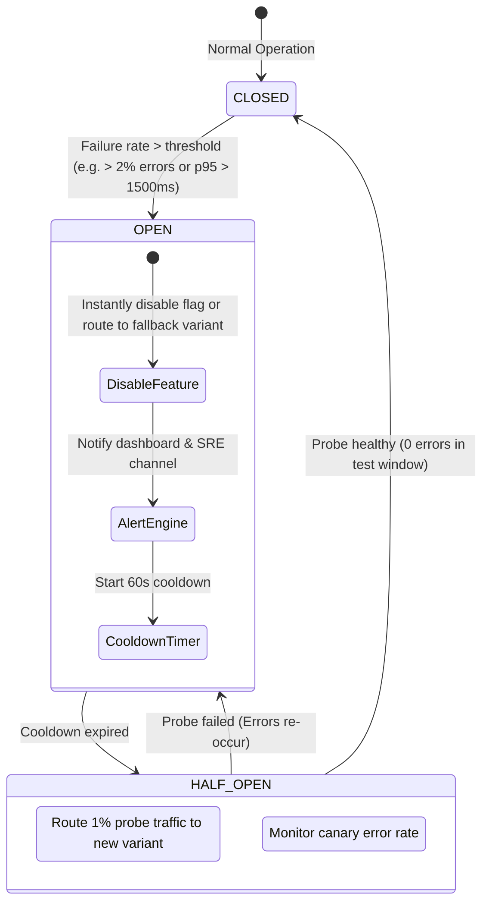
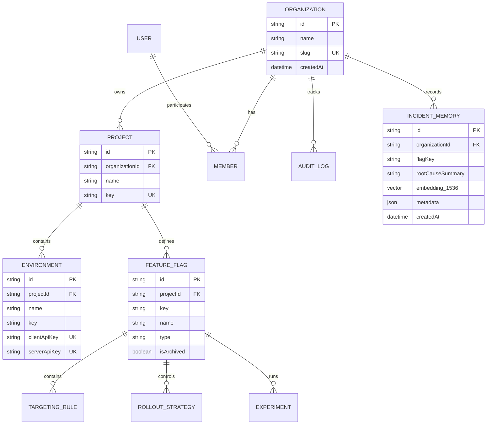

# FeatureOS — Technical Architecture & System Design

> **Document Type**: Core Architecture Specification  
> **Version**: 1.0.0  
> **Target Audience**: Platform Engineers, Backend Developers, Distributed Systems Architects

---

## 1. Executive System Topology

FeatureOS is structured as an AI-native distributed platform combining low-latency flag evaluation with an asynchronous analytical streaming pipeline and an autonomous multi-agent reasoning runtime.



---

## 2. Core Subsystems & Data Flows

### 2.1 Low-Latency Flag Evaluation & Real-Time Sync (Sub-10ms)
Feature flags must be evaluated in under 10ms with zero network hops whenever evaluated in-process via SDKs, or sub-15ms via edge REST evaluation.



### 2.2 Telemetry & Event Ingestion Pipeline
All evaluations, interactions, errors, and performance markers flow through an asynchronous backpressure-protected pipeline.



### 2.3 Autonomous Multi-Agent AI Runtime (LangGraph)
A multi-agent state graph continuously analyzes telemetry and coordinates decisions with human approval.



### 2.4 Self-Healing Circuit Breaker State Machine
FeatureOS guards against production incidents by automatically detecting degraded flags and degrading gracefully.



---

## 3. Monorepo Structure & Package Dependencies

FeatureOS is governed by strict boundaries across apps and packages:

```
feature-os/
├── apps/
│   ├── web/                    # Next.js 15 (Dashboard UI)
│   │   ├── app/                # App Router: (auth), (dashboard), api/
│   │   ├── components/         # shadcn/ui components & feature widgets
│   │   ├── lib/                # Apollo client, TanStack query, Zustand stores
│   │   └── styles/             # Tailwind CSS v4 definitions
│   │
│   ├── api/                    # Express.js Core Backend
│   │   ├── src/
│   │   │   ├── modules/        # Feature Modules: auth, flags, rollouts, telemetry...
│   │   │   ├── graphql/        # Apollo schemas, resolvers, and context
│   │   │   ├── sse/            # Server-Sent Events hub & Redis subscriber
│   │   │   ├── kafka/          # Kafka producers & consumer workers
│   │   │   └── middleware/     # Auth, RBAC, Zod validation, error handler
│   │   └── server.ts           # HTTP & WebSocket initialization
│   │
│   └── ai-service/             # FastAPI AI Engine
│       ├── app/
│       │   ├── agents/         # LangGraph agents: Telemetry, Cohort, Rollout, Policy
│       │   ├── ml/             # scikit-learn clustering & anomaly detection
│       │   ├── bayesian/       # Bayesian A/B statistical testing models
│       │   ├── memory/         # pgvector embeddings & vector search
│       │   └── api/v1/         # FastAPI endpoints (/clustering, /recommendations)
│       └── main.py
│
├── packages/
│   ├── types/                  # Shared TypeScript interfaces & Zod schemas
│   ├── sdk-js/                 # Client SDK: Vanilla JS, React hooks, Node client
│   ├── db/                     # Prisma schema, migrations, seeders
│   └── config/                 # Shared tsconfig, ESLint, Prettier, Env schemas
│
└── docker/                     # Docker Compose local development definitions
```

### Dependency Flow Rules
1. `apps/*` may depend on `packages/*`.
2. `apps/*` must **never** import directly from another `app` (isolated processes communicating strictly via HTTP/GraphQL/SSE/Kafka).
3. `packages/types` must remain pure TypeScript with zero runtime side-effects (only type definitions, enums, and Zod schemas).
4. `packages/db` encapsulates all Prisma client logic and schema migrations.

---

## 4. Multi-Tenant Data Model & Storage Schema

### 4.1 PostgreSQL (Operational Relational Store + pgvector)
Managed via Prisma ORM (`packages/db/prisma/schema.prisma`):



### 4.2 ClickHouse (Analytical Columnar Store)
High-performance analytical tables configured with MergeTree engines:

```sql
-- 1. Exposures Table (tracks every flag evaluation)
CREATE TABLE IF NOT EXISTS exposures (
    timestamp DateTime64(3, 'UTC'),
    organization_id UUID,
    project_id UUID,
    environment_id UUID,
    flag_key LowCardinality(String),
    variant_key LowCardinality(String),
    user_id String,
    device LowCardinality(String),
    browser LowCardinality(String),
    country LowCardinality(String),
    app_version String
) ENGINE = MergeTree()
PARTITION BY toYYYYMM(timestamp)
ORDER BY (organization_id, project_id, flag_key, timestamp);

-- 2. Telemetry Events (interactions & business metrics)
CREATE TABLE IF NOT EXISTS telemetry_events (
    timestamp DateTime64(3, 'UTC'),
    organization_id UUID,
    project_id UUID,
    environment_id UUID,
    user_id String,
    event_name LowCardinality(String),
    numeric_value Float64,
    properties String
) ENGINE = MergeTree()
PARTITION BY toYYYYMM(timestamp)
ORDER BY (organization_id, event_name, timestamp);

-- 3. Telemetry Errors & Performance
CREATE TABLE IF NOT EXISTS telemetry_errors (
    timestamp DateTime64(3, 'UTC'),
    organization_id UUID,
    flag_key LowCardinality(String),
    user_id String,
    error_message String,
    stack_trace String,
    duration_ms Float32
) ENGINE = MergeTree()
PARTITION BY toYYYYMM(timestamp)
ORDER BY (organization_id, flag_key, timestamp);
```

---

## 5. Security & Isolation Architecture

- **Tenant Isolation**: Every database query is tenant-scoped by `organizationId`. Cross-tenant data leakage is strictly prohibited via Prisma middleware filters and row-level checks.
- **RBAC Matrix**: Enforced at the gateway layer through hierarchical permissions:
  - `Owner`: Full administrative, billing, and organizational authority.
  - `Admin`: User management, project settings, flag approvals.
  - `Developer`: Create and edit flags, configure targeting rules, trigger rollouts in non-prod.
  - `Product Manager`: Manage experiments, configure non-destructive targeting rules.
  - `SRE`: Circuit breaker overrides, emergency rollbacks, health thresholds.
  - `Viewer`: Read-only access to flags, metrics, and audit logs.
- **API Key Scoping**: Environment keys distinguish between `Client SDK Keys` (restricted to evaluating flags for that environment with no administrative power) and `Server API Keys` (privileged access).
- **Audit Tamper-Evidence**: Audit log entries are strictly append-only and cryptographically hashed with event sourcing guarantees.
